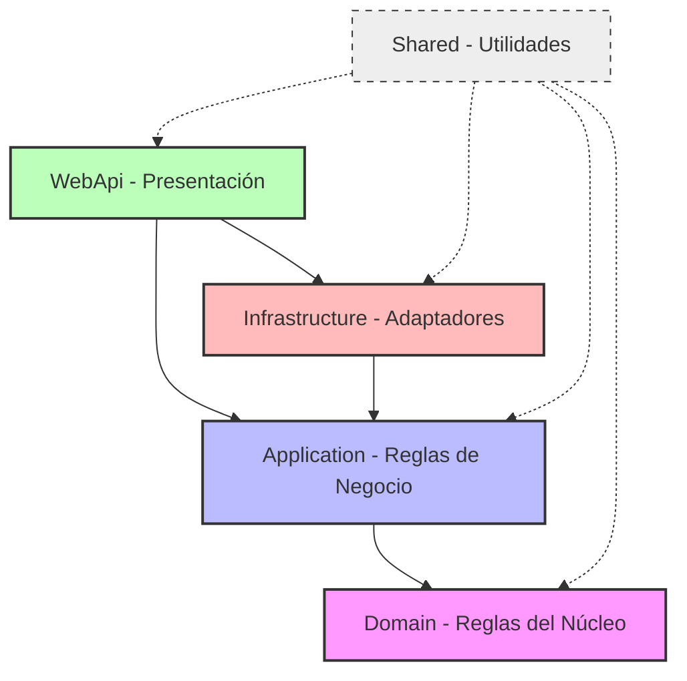
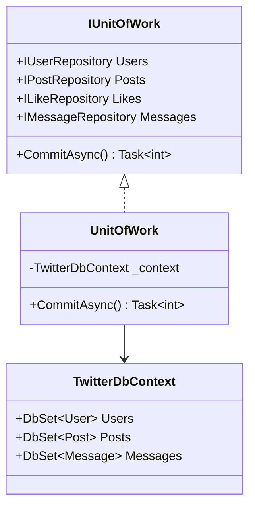
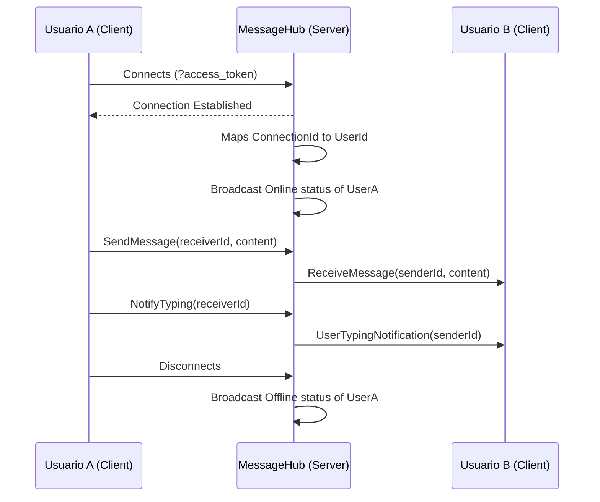

# Documentación Técnica del Proyecto Backend

## 1. Resumen General

El proyecto **`Twitter`** (ubicado en `E:\PROGRAMAS\BACKEND\Twitter`) es una **Web API construida con .NET 10.0** y **Entity Framework Core** que implementa el backend completo para un clon de red social tipo Twitter/X. Cuenta con mensajería privada en tiempo real, feed interactivo de publicaciones, perfiles de usuario, relaciones de seguimiento (follows), chatbots impulsados por Inteligencia Artificial y un robusto módulo de administración y moderación.

**Objetivo principal:**  
Proporcionar una API REST robusta, segura y escalable, junto con canales de comunicación en tiempo real bidireccionales y procesos automatizados en segundo plano que den soporte a todas las interacciones de los clientes frontend.

**Tipo de sistema:**  
Backend monolítico modular estructurado bajo los principios de **Arquitectura Limpia (Clean Architecture)** y diseño guiado por el dominio (DDD), con persistencia en base de datos relacional SQL Server y transporte de datos en tiempo real mediante **ASP.NET Core SignalR**.

**Usuarios principales y roles en el sistema:**
- **Usuarios Públicos (no autenticados):** Registro de cuenta, verificación de contraseñas e inicio de sesión seguro.
- **Usuarios Autenticados (Miembros):** Gestión de feed, creación de publicaciones, interacciones sociales (likes, retweets, comentarios), subida de contenido multimedia, mensajería directa en tiempo real, edición de perfil y chat con IA.
- **Administradores / Moderadores:** Monitoreo y métricas mediante un panel de control, auditoría de operaciones, edición de configuraciones de sistema, gestión de reportes de contenido y suspensiones de cuentas.

**Funcionalidades principales:**
- **Seguridad y Autenticación:** Registro e inicio de sesión con encriptación BCrypt, generación y validación estricta de tokens JWT, y mecanismo de renovación mediante Refresh Tokens.
- **Feed y Contenido:** Creación de publicaciones (posts) que admiten multimedia (imágenes, video, audio grabado), likes, comentarios anidados, retweets con cita, y publicaciones efímeras (con fecha de expiración).
- **Mensajería en Tiempo Real:** Chat privado directo con confirmaciones de lectura, estados de presencia de usuario (online/offline) y notificaciones de escritura ("typing...").
- **Integración con IA:** Generación inteligente de textos de publicaciones mediante llamadas a la API de Groq AI y asistente virtual (chatbot) interactivo con almacenamiento del historial de conversación.
- **Módulo de Moderación:** Creación de reportes de contenido sensible, suspensión temporal o permanente de cuentas, registro histórico de auditoría de administradores y estadísticas integradas.
- **Almacenamiento y Notificaciones:** Abstracción de motores de guardado (almacenamiento local o Spaces de DigitalOcean) y envío automático de correos electrónicos transaccionales usando SMTP con plantillas dinámicas.

---

## 2. Tecnologías Utilizadas

### C# & .NET 10.0
**Uso en el proyecto:**  
Plataforma y lenguaje principal del sistema. Se aprovechan las últimas características de C# (Global Usings, File-scoped Namespaces, Records, Pattern Matching avanzado) para lograr un código limpio, performante y con tipado fuerte.
**Ubicación:** Todo el código del proyecto.

### ASP.NET Core Web API
**Uso en el proyecto:**  
Framework web base. Implementa el pipeline de peticiones HTTP, el enrutamiento de controladores REST, la inyección de dependencias nativa, la serialización JSON uniforme (en formato camelCase) y la generación del esquema OpenAPI (Scalar/Swagger).
**Ubicación:** Proyecto `WebApi`.

### Entity Framework Core (EF Core 10.0)
**Uso en el proyecto:**  
ORM (Object-Relational Mapper) principal. Maneja las consultas a base de datos usando LINQ, gestiona las relaciones entre entidades, orquesta las migraciones de base de datos (`Migrations`) e implementa los patrones Repository y Unit of Work en combinación con SQL Server.
**Ubicación:** `Domain/Database` e `Infrastructure/Persistence`.

### SQL Server
**Uso en el proyecto:**  
Motor de base de datos relacional que almacena toda la información transaccional del sistema (usuarios, posts, relaciones, configuraciones, auditoría y mensajería).
**Ubicación:** Configurado en `WebApi/appsettings.json` mediante cadenas de conexión EF Core.

### ASP.NET Core SignalR
**Uso en el proyecto:**  
Biblioteca de comunicación bidireccional en tiempo real. Configura un hub de comunicación (`MessageHub`) que centraliza el envío de mensajes privados instantáneos, los indicadores de escritura ("typing indicators") y la sincronización del estado de presencia online/offline.
**Ubicación:** `WebApi/Hubs` y registro en `WebApi/Program.cs`.

### JWT (JSON Web Tokens)
**Uso en el proyecto:**  
Mecanismo de autorización sin estado. La API valida las firmas de los tokens JWT en cada petición protegida mediante políticas integradas de ASP.NET Core Authentication, y provee soporte para la resolución de claims personalizados (roles, permisos, IDs de usuario).
**Ubicación:** `WebApi/Extensions/ServiceCollectionExtension.cs` (`AddJwtAuthentication`).

### BCrypt.Net
**Uso en el proyecto:**  
Biblioteca de criptografía utilizada para realizar el hashing seguro y la verificación de contraseñas de usuarios con factores de sal automáticos, impidiendo el almacenamiento de texto plano en la base de datos.
**Ubicación:** `Shared/Hasher.cs`.

### FluentValidation
**Uso en el proyecto:**  
Validación fuertemente tipada de peticiones entrantes (requests). Garantiza que los payloads que llegan a los controladores cumplan con reglas de negocio estrictas antes de ejecutar los casos de uso del backend.
**Ubicación:** `Application/Validators`.

### Serilog
**Uso en el proyecto:**  
Logger estructurado y centralizado que reemplaza el proveedor de logging por defecto de .NET. Registra eventos clave en consola y archivos locales con distintos niveles de criticidad (Info, Warning, Error, Fatal).
**Ubicación:** `WebApi/Program.cs` y extensiones de configuración de inicio.

### Groq AI API & HttpClient
**Uso en el proyecto:**  
Servicios integrados mediante clientes HTTP optimizados (`HttpClientFactory`) para comunicarse con la API de Groq AI. Provee generación automatizada de textos para publicaciones y las respuestas contextuales del chatbot de asistencia del usuario.
**Ubicación:** `Application/Services/GroqPostTextGenerationService.cs` y `Application/Services/ChatbotService.cs`.

### Almacenamiento Adaptativo (Local / DigitalOcean Spaces)
**Uso en el proyecto:**  
Uso del patrón Strategy. Permite alternar la persistencia de archivos subidos por el usuario (fotos de perfil, videos, audios) entre el sistema de archivos del servidor local (`LocalFileStorageService`) y un almacenamiento en la nube compatible con S3 como DigitalOcean Spaces (`SpacesStorageService`).
**Ubicación:** `Infrastructure/Persistence/Storage` e `Domain/Interfaces/Services/IMediaStorageService.cs`.

### SMTP & System.Net.Mail
**Uso en el proyecto:**  
Servicio de envío de correo electrónico configurado para despachar notificaciones transaccionales (códigos OTP de registro, restablecimiento de contraseñas, etc.) utilizando plantillas HTML personalizables cargadas de la base de datos.
**Ubicación:** `Shared/SMTP.cs` e `Application/Services/EmailService.cs`.

---

## 3. Arquitectura General

El backend se rige bajo la filosofía de **Arquitectura Limpia (Clean Architecture)**. La regla fundamental es que **las dependencias van hacia el centro**: las capas más externas conocen a las más internas, pero las internas no conocen ningún detalle de implementación de las externas.



### Descripción de las Capas

#### 1. Capa de Dominio (`Domain`)
Representa el corazón de la aplicación. Contiene el estado del negocio y las abstracciones del sistema.
- **Entidades de Base de Datos:** Clases C# mapeadas a tablas SQL Server (por ejemplo, `User`, `Post`, `Like`, `Message`, `ContentReport`, `UserSuspension`).
- **Enums:** Constantes descriptivas del dominio (`MediaType`).
- **Interfaces de Repositorios:** Abstracciones para interactuar con la base de datos sin acoplarse a tecnologías específicas (por ejemplo, `IUserRepository`, `IPostRepository`).
- **Contexto de Datos y Migraciones:** La definición de `TwitterDbContext` y el historial de migraciones de EF Core.
*No tiene dependencias externas de otros proyectos del backend.*

#### 2. Capa de Aplicación (`Application`)
Define los casos de uso del sistema. Se encarga de procesar los datos recibidos de la capa externa, orquestar las entidades de dominio y coordinar la ejecución del negocio.
- **Servicios de Aplicación:** Implementan la lógica de negocio concreta (por ejemplo, `PostService` para crear posts, `AuthService` para verificar credenciales).
- **Contratos (Interfaces):** Abstracciones de servicios.
- **Modelos DTO:** Modelos dedicados para recibir datos de entrada (`Requests`) y formatear datos de salida (`Responses`).
- **Validadores:** Reglas con FluentValidation que protegen el estado de la aplicación.
*Depende únicamente del proyecto Domain.*

#### 3. Capa de Infraestructura (`Infrastructure`)
Contiene las implementaciones técnicas de bajo nivel y adaptadores para herramientas externas.
- **Persistencia en SQL Server:** Implementación del patrón Unit of Work (`UnitOfWork`) y de todos los repositorios concretos que utilizan Entity Framework Core para interactuar con SQL Server.
- **Servicios en Segundo Plano (Background Services):** Procesos que corren asíncronamente en el host (como `EphemeralPostCleanupService` para borrar posts expirados).
- **Adaptadores de Almacenamiento:** Código para escribir archivos de media en el disco local o enviarlos a DigitalOcean Spaces.
*Depende de Application y Domain.*

#### 4. Capa de Presentación (`WebApi`)
El punto de entrada físico de la aplicación. Gestiona la infraestructura de la red, los protocolos de comunicación y la exposición de los endpoints públicos.
- **Controladores REST (`Controllers`):** Mapean los paths HTTP (GET, POST, etc.), gestionan los códigos de estado y delegan la ejecución en los servicios de aplicación.
- **Tiempo Real (`Hubs`):** Hub de SignalR para mensajería y presencia.
- **Middlewares y Filtros:** Captura global de errores (`ErrorHandlerMiddleware`), filtros de auditoría, restricciones de seguridad (`RequirePermissionAttribute`).
- **Configuración de Pipeline (`Program.cs`):** Punto de arranque que consolida la inyección de dependencias (`DependencyInjection`), los servicios integrados y el flujo de ejecución (middlewares).
*Depende de Infrastructure, Application y Domain.*

#### 5. Capa Compartida (`Shared`)
Un módulo transversal utilitario. Provee herramientas utilitarias que no interfieren con la lógica del negocio pero que son necesarias en todas las capas del sistema.
- **Constants:** Constantes globales (roles, permisos, errores, JWT).
- **Helpers:** Formateadores de fecha o resolvedores de tipo de contenido.
- **Utilities:** El resolvedor de SMTP y la envoltura estática del encriptador `Hasher`.
*Puede ser importada por cualquier capa del sistema.*

---

## 4. Estructura de Carpetas

A continuación, se detalla la estructura física del proyecto backend en disco y la función que cumple cada carpeta clave:

| Proyecto / Carpeta | Subcarpetas clave | Descripción técnica |
| :--- | :--- | :--- |
| **`Domain/`** | `Database/SqlServer/Context` | Define la clase `TwitterDbContext` de Entity Framework Core. |
| | `Database/SqlServer/Entities` | Entidades puras mapeadas a tablas (ej. `User.cs`, `Post.cs`). |
| | `Database/SqlServer/Migrations`| Historial y archivos autogenerados de migraciones de la base de datos. |
| | `Interfaces/Repositories` | Contratos de persistencia para cada entidad (ej. `IPostRepository.cs`). |
| | `Interfaces/Services` | Interfaces de infraestructura requeridas por el Dominio (ej. `IMediaStorageService.cs`). |
| **`Application/`** | `Interfaces/Services` | Contratos de los servicios de aplicación (casos de uso). |
| | `Services/` | Implementación de la lógica de negocio (ej. `PostService.cs`). |
| | `Models/DTOs` | Objetos de transferencia de datos de salida (ej. `PostDto.cs`). |
| | `Models/Requests` | Payloads y parámetros de entrada HTTP (ej. `CreatePostRequest.cs`). |
| | `Models/Responses` | Formato unificado de respuestas complejas de negocio (ej. `LoginAuthResponse.cs`). |
| | `Validators/` | Reglas automáticas de validación por request (ej. `UploadMediaRequestValidator.cs`). |
| | `Helpers/` | Clases auxiliares para la generación de tokens, procesamiento OTP y responses. |
| **`Infrastructure/`** | `Persistence/SqlServer/` | Implementa el `UnitOfWork.cs` y los repositorios EF Core en SQL Server. |
| | `Persistence/Storage/` | Adaptadores de guardado físico de archivos (local y compatible con Amazon S3). |
| | `Background/` | HostedServices que se ejecutan en segundo plano en el servidor. |
| **`WebApi/`** | `Controllers/` | Controladores REST públicos y administrativos (heredan de `ApiControllerBase`). |
| | `Hubs/` | Define el `MessageHub.cs` para conexiones WebSocket en tiempo real. |
| | `Middlewares/` | Interceptores de request/response (ej. `ErrorHandlerMiddleware.cs`). |
| | `Attributes/` | Atributos declarativos de autorización y validación. |
| | `Extensions/` | Configuración modularizada de DI (ej. `ServiceCollectionExtension.cs`). |
| **`Shared/`** | `Constants/` | Constantes transversales (ej. `PermissionConstants.cs`, `RoleConstants.cs`). |
| | `Helpers/` | Utilidades puras libres de dependencias (ej. `DateTimeHelper.cs`). |

---

## 5. Servicios de Aplicación (Capa de Negocio)

La lógica de negocio reside en los servicios ubicados en el proyecto `Application`. Estos servicios actúan como puentes entre los controladores (capa de presentación) y los repositorios (capa de datos).

A continuación se detallan los servicios de aplicación implementados en el sistema:

### AuthService
- **Archivo:** `Application/Services/AuthService.cs`
- **Responsabilidad:** Gestiona el ciclo de vida de la sesión del usuario, verificación de credenciales, autenticación de doble factor (OTP) y renovación de tokens JWT.
- **Qué problema resuelve:** Aísla las reglas complejas de seguridad de la API, encapsulando la emisión de tokens y la manipulación de Refresh Tokens.
- **Dependencias principales:** `IUserRepository`, `IAuthRepository`, `IUnitOfWork`, `SMTP`.
- **Métodos principales:**
  - `LoginAsync(LoginAuthRequest request)`: Valida el nickname/email del usuario, comprueba el hash de la contraseña, verifica que no esté suspendido y genera el par de tokens (Access y Refresh).
  - `RenewTokenAsync(RenewAuthRequest request)`: Valida un Refresh Token expirado/activo y devuelve un nuevo set de credenciales.
  - `VerifyOtpAsync(VerifyOtpRequest request)`: Confirma si un código OTP enviado por email al registrarse es correcto y activa la cuenta del usuario.

### PostService
- **Archivo:** `Application/Services/PostService.cs`
- **Responsabilidad:** Orquesta la creación, edición, borrado e interacciones de las publicaciones (posts) del feed.
- **Qué problema resuelve:** Centraliza el manejo de borradores, posts efímeros, la inyección de metadatos de usuario en las publicaciones y la obtención del feed personalizado.
- **Dependencias principales:** `IPostRepository`, `IPostMediaRepository`, `ICacheService`, `IUnitOfWork`.
- **Métodos principales:**
  - `CreatePostAsync(CreatePostRequest request, int currentUserId)`: Guarda un post en la base de datos, procesa la media adjunta, calcula la expiración opcional y limpia el caché del feed.
  - `GetFeedAsync(GetAllPostRequest query, int currentUserId)`: Recupera las publicaciones públicas o de seguidos aplicando paginación y ordenamiento temporal.
  - `DeletePostAsync(int postId, int currentUserId)`: Valida la autoría de un post antes de marcarlo como eliminado.

### MessageService
- **Archivo:** `Application/Services/MessageService.cs`
- **Responsabilidad:** Controla el almacenamiento de mensajes privados, chats directos e historial entre usuarios.
- **Qué problema resuelve:** Mantiene la persistencia de los chats privados sin interferir con la transmisión instantánea (SignalR) y computa contadores de mensajes no leídos.
- **Dependencias principales:** `IMessageRepository`, `IUserRepository`, `IUnitOfWork`.
- **Métodos principales:**
  - `SendMessageAsync(SendMessageRequest request, int senderId)`: Inserta un nuevo mensaje directo en la base de datos.
  - `GetConversationAsync(int currentUserId, int otherUserId, int limit, int offset)`: Retorna la lista paginada de mensajes compartidos con un usuario.
  - `MarkAsReadAsync(int messageId, int userId)`: Actualiza de forma segura el estado de lectura de un mensaje específico.

### ChatbotService
- **Archivo:** `Application/Services/ChatbotService.cs`
- **Responsabilidad:** Gestiona las conversaciones interactivas de los usuarios con el asistente virtual de inteligencia artificial.
- **Qué problema resuelve:** Almacena y recupera el historial de chat con el bot y se conecta con el motor de lenguaje de Groq AI mediante HTTP.
- **Dependencias principales:** `IChatbotMessageRepository`, `HttpClient`, `IConfiguration`.
- **Métodos principales:**
  - `SendMessageToBotAsync(SendChatbotMessageRequest request, int userId)`: Agrega la pregunta del usuario al historial, envía la conversación completa al modelo de lenguaje Groq y registra la respuesta de la IA.
  - `GetChatbotHistoryAsync(int userId, int limit, int offset)`: Recupera los mensajes previos intercambiados entre el usuario y la IA.

### Otros Servicios Clave:
- **UserService (`UserService.cs`):** Gestión de perfiles, modificación de datos públicos, cambio de contraseñas y obtención de perfiles ajenos.
- **FollowService (`FollowService.cs`):** Implementa las operaciones sociales de seguir (`Follow`), dejar de seguir (`Unfollow`) y listados de seguidores/seguidos.
- **LikeService (`LikeService.cs`):** Alterna el estado de me gusta de publicaciones actualizando contadores de forma consistente.
- **CommentService & RetweetService:** Manejo de respuestas y tweets citados vinculando entidades con claves foráneas autorreferenciales.
- **SuspensionService & ReportService:** Gestión del flujo de moderación de contenido y administración de penalizaciones a cuentas de usuario.
- **DashboardService & AuditService:** Proporcionan datos agregados estadísticos y el listado de logs de auditoría para la consola administrativa.
- **MediaService & AvatarService:** Controlan la lógica para guardar archivos multimedia en el backend y asignarlos a publicaciones o perfiles.

---

## 6. Persistencia y Acceso a Datos (Repositorios)

El backend utiliza Entity Framework Core 10 sobre SQL Server e implementa el patrón **Repository y Unit of Work** para asegurar la consistencia y transaccionalidad de las operaciones.



### 1. El DbContext (`TwitterDbContext`)
Es la clase central que conecta EF Core con la base de datos de SQL Server.
- Configura las reglas de mapeo de tablas, índices y relaciones a través del método `OnModelCreating` (Fluent API).
- Habilita índices únicos en columnas sensibles como el `Username`, `Email` y `Nickname` del usuario.
- Implementa relaciones de muchos a muchos (como la tabla `UserRole` o `RolePermission`) y auto-relaciones complejas (como seguidores en `Follow` o comentarios anidados en `Post`).

### 2. El Patrón Unit of Work (`IUnitOfWork` / `UnitOfWork`)
Centraliza el acceso a todos los repositorios compartiendo una única instancia del contexto de base de datos (`TwitterDbContext`) bajo un ciclo de vida `Scoped`.
- **Propósito:** Agrupar múltiples escrituras o modificaciones en repositorios separados bajo una misma transacción de base de datos.
- **Funcionamiento:** Los servicios inyectan `IUnitOfWork`, realizan operaciones sobre las propiedades de repositorio expuestas (ej. `_unitOfWork.Posts.Add(...)`, `_unitOfWork.Likes.Remove(...)`) y finalmente confirman todos los cambios en un solo viaje llamando a `_unitOfWork.CommitAsync()`.

### 3. Repositorios Genéricos y Concretos (`GenericRepository` / Repositorios Heredados)
- **`GenericRepository<T>`:** Provee una implementación base para las operaciones CRUD elementales (`GetByIdAsync`, `GetAllAsync`, `AddAsync`, `Update`, `Delete`).
- **Repositorios Concretos (ej. `PostRepository`):** Heredan de `GenericRepository` y extienden su funcionalidad con consultas de base de datos altamente específicas, utilizando la cláusula `Include` para cargar relaciones bajo demanda (Eager Loading) u optimizar el rendimiento mediante proyecciones directas (`Select`).

---

## 7. Controladores API REST (WebApi)

La exposición de endpoints REST se divide en dos categorías lógicas: controladores de negocio (miembros) y controladores administrativos. Todos los controladores heredan de `ApiControllerBase`, que centraliza el manejo de respuestas estándar de la API.

### Endpoints Principales del Sistema

```text
[POST]   /api/auth/login                  --> Autenticación de usuario.
[POST]   /api/auth/renew                  --> Renovación del token JWT.
[POST]   /api/auth/verify-otp             --> Activación de cuenta por OTP.
[POST]   /api/user/register-init          --> Pre-registro de usuario.
[GET]    /api/user/me                     --> Perfil del usuario autenticado.
[PUT]    /api/user/update                 --> Actualización de datos del perfil.
[GET]    /api/post/feed                   --> Listado paginado de publicaciones.
[POST]   /api/post/create                 --> Publicación de nuevo post/borrador.
[POST]   /api/post/{id}/like              --> Alternar Like en publicación.
[POST]   /api/post/{id}/comment           --> Comentar una publicación.
[POST]   /api/post/{id}/retweet           --> Retuitear o citar una publicación.
[DELETE] /api/post/{id}                   --> Eliminación lógica/física de post.
[POST]   /api/follow/{userId}             --> Seguir a un usuario.
[DELETE] /api/follow/{userId}             --> Dejar de seguir a un usuario.
[GET]    /api/message/conversation/{id}   --> Historial de chat con un usuario.
[POST]   /api/message/send                --> Guardar mensaje en base de datos.
[POST]   /api/chatbot/send                --> Enviar mensaje e interactuar con la IA.
```

### Endpoints Administrativos (Requieren rol Admin/Moderador)

```text
[GET]    /api/admin/dashboard/stats       --> Métricas de uso y rendimiento globales.
[GET]    /api/admin/reports               --> Listado de reportes de contenido.
[POST]   /api/admin/reports/{id}/resolve  --> Moderación y resolución de reportes.
[POST]   /api/admin/suspensions/create    --> Suspender temporal/permanentemente a un usuario.
[GET]    /api/admin/audit/logs            --> Historial de acciones ejecutadas por administradores.
[PUT]    /api/admin/config/update         --> Modificación de parámetros del sistema en caliente.
```

---

## 8. Comunicación en Tiempo Real (SignalR Hub)

La aplicación utiliza **SignalR** para manejar todas las comunicaciones instantáneas bidireccionales de baja latencia a través de la clase `MessageHub` en `WebApi/Hubs/MessageHub.cs`.



### Aspectos de Diseño de la Mensajería en Tiempo Real:

1. **Autenticación en WebSockets (`UserIdProvider`):**
   - Dado que los navegadores web no pueden adjuntar headers HTTP personalizados en conexiones WebSocket, el token JWT se envía mediante el parámetro de consulta (query string) `?access_token=...`.
   - El middleware de autenticación configurado en `ServiceCollectionExtension` intercepta este parámetro y lo inyecta en el contexto de seguridad.
   - La clase `UserIdProvider` (que implementa `IUserIdProvider`) mapea la conexión interna de SignalR directamente con el `ClaimTypes.NameIdentifier` (ID de base de datos del usuario), permitiendo dirigir mensajes de servidor a IDs de usuario específicos (`Clients.User(userId.ToString())`) en vez de IDs de conexión volátiles.

2. **Gestión de Presencia (Online / Offline):**
   - **`OnConnectedAsync`:** Cuando un usuario inicia la conexión al hub, se extrae su ID, se almacena su estado online en memoria y se dispara una llamada de difusión (`Broadcast`) notificando a los demás usuarios que está en línea.
   - **`OnDisconnectedAsync`:** Al perderse la conexión física o cerrarse la aplicación cliente, se remueve el ID del registro y se transmite la desconexión a la red.

3. **Notificaciones de Escritura ("Typing Indicators"):**
   - El hub expone métodos ligeros como `NotifyTyping` y `NotifyStopTyping` que no tocan la base de datos. Transmiten instantáneamente eventos directos al destinatario para que el cliente frontend dibuje un indicador visual de escritura activa ("el usuario está escribiendo...").

---

## 9. Servicios en Segundo Plano (Background Services)

El backend ejecuta procesos automáticos y asíncronos en segundo plano heredando de `BackgroundService` de .NET Core, permitiendo optimizar el mantenimiento del servidor sin degradar la experiencia de usuario.

### 1. EphemeralPostCleanupService
- **Archivo:** `Infrastructure/Background/EphemeralPostCleanupService.cs`
- **Frecuencia de ejecución:** Periódica (ej. cada 1 minuto).
- **Responsabilidad:** Buscar en la base de datos de SQL Server todos los posts cuya fecha de expiración (`ExpiresAt`) sea menor a la hora UTC actual.
- **Qué problema resuelve:** Implementa de forma transparente la funcionalidad de publicaciones efímeras (historias o posts temporales) purgando de la base de datos las publicaciones que cumplieron su ciclo de vida.

### 2. OrphanedMediaCleanupService
- **Archivo:** `Infrastructure/Background/OrphanedMediaCleanupService.cs`
- **Frecuencia de ejecución:** Programada (ej. diariamente a horas de bajo tráfico).
- **Responsabilidad:** Identificar registros en la tabla `PostMedia` y archivos físicos en el disco local o bucket de Spaces que no estén vinculados a ninguna publicación activa (por ejemplo, imágenes subidas que el usuario nunca llegó a confirmar en una publicación).
- **Qué problema resuelve:** Previene el desbordamiento de almacenamiento en el disco local o costos innecesarios en la nube eliminando archivos "huérfanos".

---

## 10. Flujo de Datos del Sistema

El procesamiento de una petición HTTP/REST típica dentro del backend sigue un flujo estrictamente secuencial y desacoplado:

1. **Recepción de Petición (Presentación):**
   La petición HTTP (por ejemplo, `POST /api/post/create`) es recibida por `PostController`.
2. **Validación Automática:**
   Antes de ingresar a la acción del controlador, la librería FluentValidation evalúa las reglas predefinidas en `CreatePostRequestValidator`. Si hay fallas de validación (por ejemplo, contenido vacío o excesivamente largo), se genera una respuesta de error estandarizada `ProblemDetails` deteniendo el flujo.
3. **Delegación de Caso de Uso (Aplicación):**
   El controlador extrae el ID del usuario del contexto JWT e invoca al servicio `IPostService.CreatePostAsync(request, userId)`.
4. **Persistencia e Integridad de Datos (Dominio e Infraestructura):**
   - El servicio mapea los datos a la entidad de dominio `Post`.
   - Interactúa con `IPostRepository` a través del patrón Unit of Work.
   - De ser necesario, se comunica con `IMediaStorageService` para guardar una imagen adjunta y persistir la URL devuelta.
   - Se confirma la operación en base de datos mediante `IUnitOfWork.CommitAsync()`, asegurando que la escritura física en SQL Server se realice dentro de una transacción segura.
5. **Respuesta Tipada:**
   El servicio retorna un objeto DTO (`PostDto`) al controlador, el cual lo envuelve en una estructura estándar de respuesta (`ApiResponseFactory.Success(...)`) y lo envía en formato JSON al cliente.

---

## 11. Buenas Prácticas de Ingeniería Detectadas

El backend cuenta con excelentes estándares de desarrollo que garantizan la mantenibilidad y extensibilidad a largo plazo:

- **Estructura Limpia y Desacoplada:** El dominio está 100% aislado. No hay rastros de Entity Framework, SQL Server, ni librerías de encriptación en los modelos del núcleo del sistema, protegiendo las reglas de negocio de cambios de infraestructura.
- **Uso de DTOs Exclusivos:** No se exponen entidades de base de datos a los endpoints públicos. Toda la comunicación API-Cliente se realiza con clases Request/Response y DTOs específicos, evitando brechas de seguridad (como sobre-asignación de propiedades) y acoplamientos innecesarios.
- **Manejo Global de Excepciones:** No existen bloques `try-catch` redundantes y repetitivos en los controladores. El pipeline cuenta con el middleware `ErrorHandlerMiddleware` que atrapa cualquier excepción inesperada, registra el error estructuradamente en Serilog y responde con un formato HTTP normalizado de tipo JSON al cliente, protegiendo los detalles internos de stacktraces.
- **Estrategia Flexible de Almacenamiento (Polimorfismo):** Mediante la abstracción de `IMediaStorageService`, el sistema puede cambiar de almacenamiento en disco local a almacenamiento en la nube (DigitalOcean Spaces) simplemente modificando una llave de configuración en `appsettings.json`, sin tocar una sola línea de código del negocio.
- **Diseño Transaccional (Unit of Work):** Evita la inconsistencia de datos garantizando que los cambios en múltiples tablas se guarden al unísono o se reviertan por completo ante errores físicos.
- **Seguridad Moderna:** Uso del algoritmo BCrypt para contraseñas de usuarios con costo dinámico, validación de claims y expiraciones milimétricas en JWT.
- **Políticas CORS Adaptadas:** Configuración CORS general restringida para endpoints REST ordinarios, y política con credenciales específicas (`SignalRPolicy`) para garantizar la conexión del transporte de mensajería instantánea sin comprometer la seguridad general del sistema.

---

## 12. Conclusión

Este backend representa una solución empresarial robusta y bien diseñada bajo el ecosistema .NET. El uso riguroso de **Clean Architecture**, en conjunto con patrones consolidados de diseño de software y herramientas modernas de la plataforma .NET 10.0, conforma una arquitectura estable, fácil de auditar, altamente escalable y perfectamente preparada para integrarse con clientes frontend modernos o interactuar con servicios externos e Inteligencia Artificial de forma natural.
